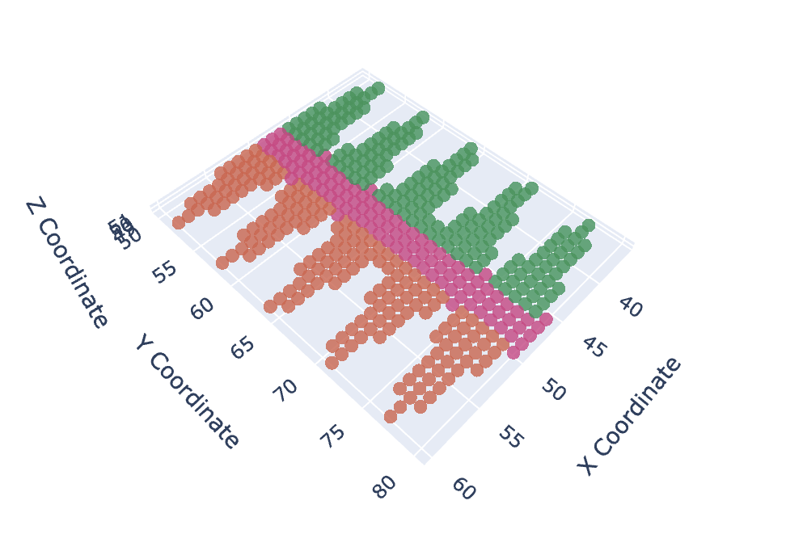
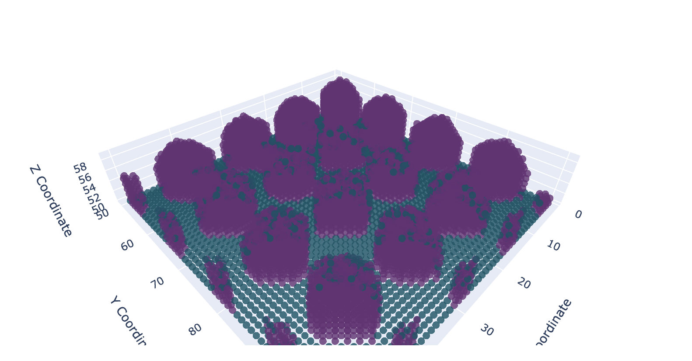

# ShapeGrowthModule

**Simulates the growth of 3D shapes using cellular automata.**

This module allows you to model, simulate, and visualize the growth of cellular structures in a discrete 3D environment. It is designed to be flexible and extensible, with tools for defining growth rules, managing cellular interactions, and generating interactive visualizations.

---

## 🔧 Features

- **Cell modeling**: Definition of cells with customizable properties (type, position, color, division potential).
- **3D environment**: Discrete grid to represent interactions between cells.
- **Dynamic simulation**: Rules for cell division and differentiation.
- **Interactive visualization**: 3D visualization tools based on PlotlyJS to analyze results.

---

## 📦 Installation

### Prerequisites
- **Julia ≥ 1.6** ([Download Julia](https://julialang.org/downloads/))

### Steps
1. Clone the repository:
```bash
   git clone https://github.com/afronvil/ShapeGrowthModule.git
   cd ShapeGrowthModule
```
2.  Launch Julia and install dependencies:
```bash
using Pkg
Pkg.activate(".")
Pkg.instantiate()
```
3.  Usage:
Load the module
```julia
using ShapeGrowthModule
```
Run a simulation
```julia
include("expl/flag.jl")
```


Project structure :

The ShapeGrowthModels module is organized as follows:
```
ShapeGrowthModule/
├── src/
│     ├── ShapeGrowthModule.jl # Main module
│     ├── struct_cell_env.jl # Definition of Cell, CellModel, etc. structures.
│     ├── data_lettres.jl # Functions for reading/writing XML files (eg, cellTypes.xml)
│     ├── functions.jl # General utility functions
│     ├── functions_max.jl # Specific utility functions (if distinct)
│     ├── visualization. jl # XML-based visualization functions (if applicable)
│     ├── visualization_2D.jl # Functions for 3D visualization with PlotlyJS
│     ├── visualization_3D.jl # Functions for 3D visualization with PlotlyJS
│     ├── utils.jl
│     └── struct_cell_env.jl # Specific logic (eg, for catch basin analysis)
├── expl/
      ├── flag.jl # Example script or simulation run
      ├── gastrulation.jl # Example script or simulation run
      ├── vertebra.jl # Example script or simulation run
      └── villosites.jl # Example script or simulation run
```

## 📊 Vizualisation
Les résultats des simulations peuvent être visualisés en 3D grâce à PlotlyJS. 
Output example:
Example 1: Growth of 2D structures (vertebra)

Example 2: Advanced 3D growth simulation (villosites)


## 🤝 Contribute
Contributions are welcome! To suggest improvements:

Open an issue to discuss changes.
Submit a pull request with your changes.


## 📄 License
This project is licensed under the MIT license.